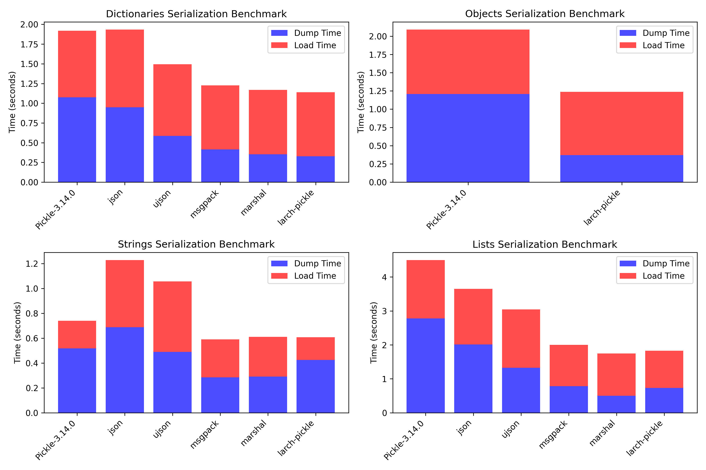

# larch.pickle - A faster and secure python pickle replacement

This module can be used as transparent replacement for pickle.

## Differences to original python pickle

- no memo attribute.
- no `clear_memo()`.
- no `persistent_id` interface.
- byte strings are always assumed to be `utf-8` encoded.
- `Pickler` has an additional `with_refs` parameter. Setting `with_refs` to `false`, the pickler will ignore object references. This can result in an extra speed boost.

## Installation

larch-pickle needs the boost library for compilation. If boost is not in the standard include path install it with:

```bash
python build_ext -I /path/to/boost install
```

## Security

Version 1.4.0 introduced a secure parameter in Unpickler. With `secure=True` the Unpickler loads only objects that are registered as secure. To register secure objects you can

- use the decorator `secure_unpickle`
- set the attribute `__pickle_secure__ = True`
- add a module name to `secure_modules`

## Speed compared to some other pickler packages

### dump Dictionaries (10 loops)

| Package      | Seconds  | Size     |
|--------------|----------|----------|
| larch-pickle | 0.30802  | 9714411  |
| marshal      | 0.354808 | 15975952 |
| msgpack      | 0.428291 | 9810043  |
| ujson        | 0.555553 | 13101307 |
| json         | 0.857648 | 14365311 |
| Pickle-3.14.0| 1.14954  | 10276493 |

### load Dictionaries (10 loops)

| Package      | Seconds  |
|--------------|----------|
| larch-pickle | 0.766926 |
| marshal      | 0.814134 |
| Pickle-3.14.0| 0.819185 |
| msgpack      | 0.844517 |
| json         | 0.904898 |
| ujson        | 0.913147 |

### dump Objects (10 loops)

| Package      | Seconds  | Size     |
|--------------|----------|----------|
| larch-pickle | 0.359494 | 10014419 |
| Pickle-3.14.0| 1.18986  | 10416542 |

### load Objects (10 loops)

| Package      | Seconds  |
|--------------|----------|
| larch-pickle | 0.847492 |
| Pickle-3.14.0| 0.85291  |

### dump Strings (10 loops)

| Package      | Seconds  | Size     |
|--------------|----------|----------|
| msgpack      | 0.19541  | 28782143 |
| marshal      | 0.308926 | 32481517 |
| larch-pickle | 0.450725 | 10885236 |
| Pickle-3.14.0| 0.546272 | 17726498 |
| ujson        | 0.547605 | 30722275 |
| json         | 0.583875 | 31701248 |

### load Strings (10 loops)

| Package      | Seconds  |
|--------------|----------|
| larch-pickle | 0.17225  |
| Pickle-3.14.0| 0.306568 |
| msgpack      | 0.435994 |
| marshal      | 0.436601 |
| json         | 0.549098 |
| ujson        | 0.729321 |

### dump Lists (10 loops)

| Package      | Seconds  | Size     |
|--------------|----------|----------|
| marshal      | 0.455435 | 42358637 |
| larch-pickle | 0.742083 | 14836084 |
| msgpack      | 0.839755 | 30757567 |
| ujson        | 1.26378  | 34673123 |
| json         | 1.71007  | 35652096 |
| Pickle-3.14.0| 2.96611  | 23654090 |

### load Lists (10 loops)

| Package      | Seconds  |
|--------------|----------|
| larch-pickle | 1.00482  |
| msgpack      | 1.25386  |
| marshal      | 1.26315  |
| json         | 1.54972  |
| Pickle-3.14.0| 1.70148  |
| ujson        | 1.72284  |



## License

larch.pickle is released under BSD licence.
